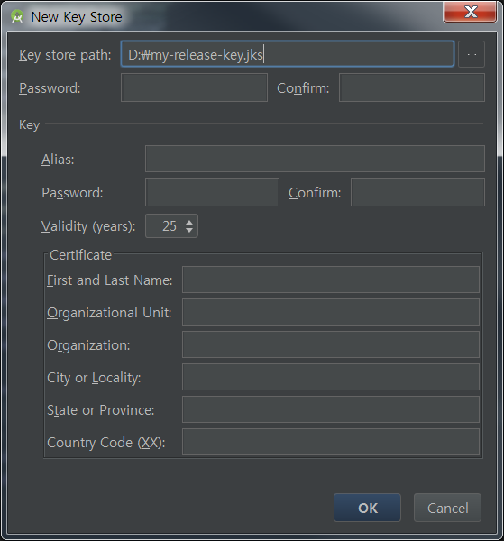
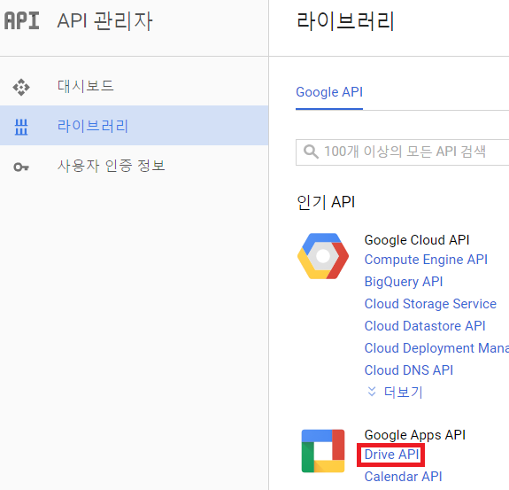
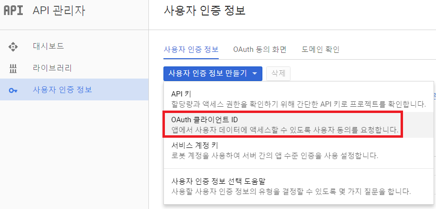
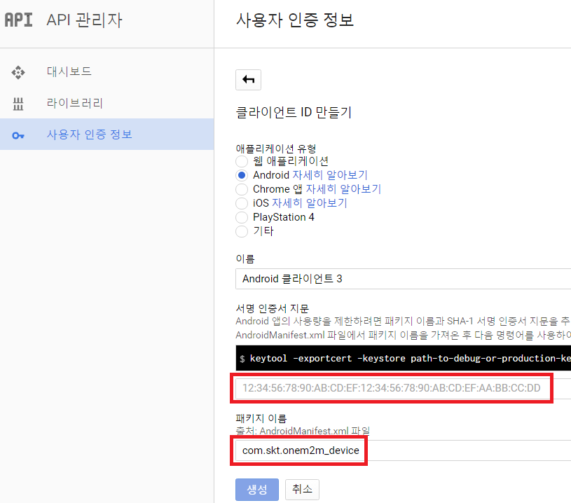
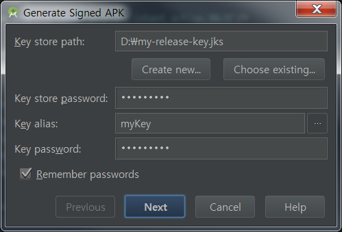
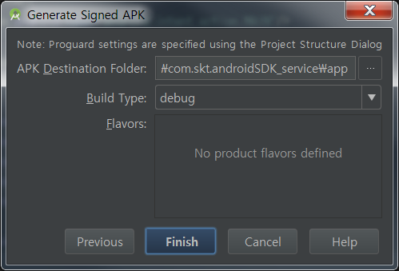

Google Drive API Configuration
===
Device App에서 카메라로 촬영한 사진을 Service App에서 원격으로 확인하기 위하여 Google Drive API를 사용합니다.
Android Studio 환경에서 Google Drive API 사용을 위한 방법을 설명합니다.

## Create Keystore and APK Signing
다음 순서로 진행한다.

* **Android Studio > Build > Generate Signed APK > Create New...**

* 생성된 키스토어 정보를 **[Google API Console](https://console.developers.google.com)**에 등록

	+ 왼쪽 **라이브러리** 메뉴에서 **Drive API** 활성화

	+ 왼쪽 **사용자 인증 정보** 메뉴에서 **OAuth 클라이언트 ID** 생성

	+ 클라이언트 ID 생성(자세한 내용은 **[사이트](https://developers.google.com/drive/android/auth)** 참고)

* 위 작업이 완료되면 생성된 키로 정보 입력 후 **Next**

* **Destination Folder** 및 **Build Type** 선택 후 **Finish** 

* 저장위치에 생성된 APK를 설치하여 사용합니다.

## 관련 사이트
* **[Google Drive Android API Official](https://developers.google.com/drive/android/intro)**
* **[Authorizing Android Apps](https://developers.google.com/drive/android/auth)**
