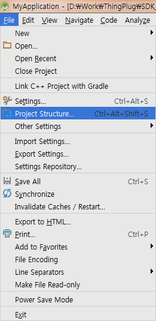
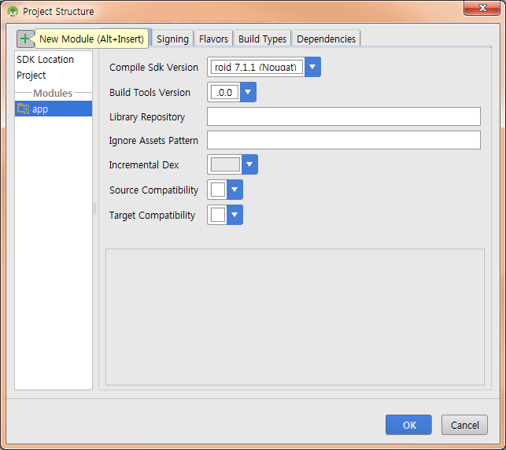
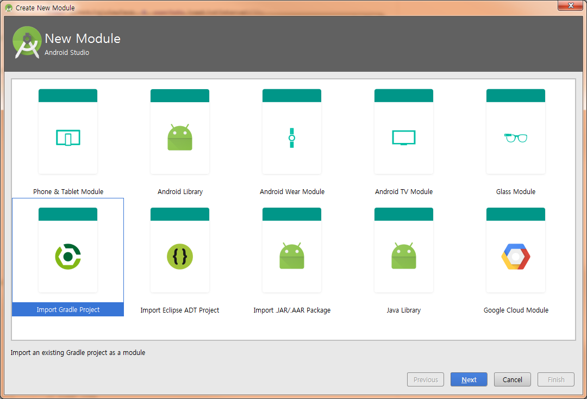
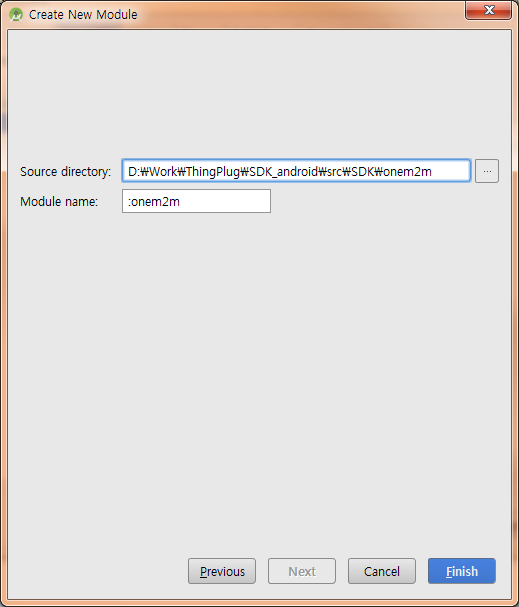
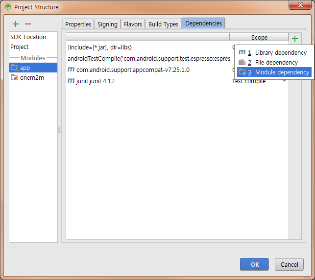
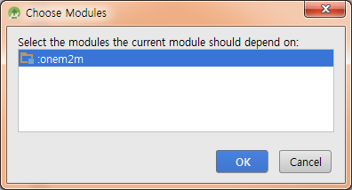
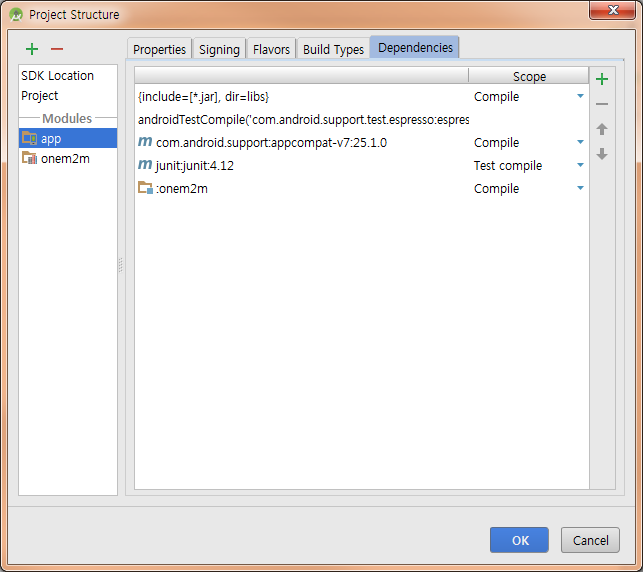

ThingPlug oneM2M SDK for Android
===

## Overview
ThingPlug oneM2M SDK for Android는 ThingPlug에 연동하고자 하는 device 개발자 및 application 개발자를 위한 Android기반 SDK입니다. IoT device 및 Application과 ThingPlug서버간의 통신에는 oneM2M 국제표준에 기반한 MQTT 프로토콜을 따르고 있으며, 보안강화를 위해 TLS를 사용할 수 있도록 구성되어 있습니다.

## Features
본 SDK에서 제공되는 API를 사용하면 oneM2M 국제표준의 세부 규격을 모르더라도 손쉽게 ThingPlug와의 통신을 구현할 수 있습니다. SDK뿐만 아니라 기본 기능시험을 위한 Simple Test App과, Android 단말이 IoT Device 역할을 하도록 해주는 Sample Device App, 그리고 Service Application 역할을 하는 Sample Service App을 같이 배포해드리고 있습니다.

## Requirements
* **[AndroidStudio](https://developer.android.com/studio/index.html)**
* **[API Level](https://developer.android.com/guide/topics/manifest/uses-sdk-element.html)**

```
defaultConfig {
	minSdkVersion 18
	targetSdkVersion 24
}
```

### Library
본 SDK에서의 ThingPlug와의 통신은 모두 MQTT를 통해서 이루어기에 MQTT client가 필요합니다.
Android SDK에서는 오픈소스 프로젝트인 paho를 사용하고 있으며, XML Serialization과 Parsing을 위하여 Simple XML을 사용합니다. 각 오픈소스 프로젝트에 대해서는 아래 링크를 참고하시기 바랍니다.

라이브러리 | 기능 | 홈페이지
------------ | ------------- | -------------
__paho__ | MQTT | **[paho Homepage](https://eclipse.org/paho/)**
__Simple XML__ | XML Serialization & Parsing | **[Simple XML Homepage](http://simple.sourceforge.net/)**

## Getting Started
ThingPlug oneM2M SDK는 소스코드 형태로 제공되며 Application에서의 사용을 위해서는 다음과 같이 import하여 사용하면 됩니다.
보다 자세한 사용 예시는 **[Simple Test App](SDK)** 소스코드를 참고하시기 바랍니다.

### Project에 oneM2M SDK 연결
신규 Project에 oneM2M SDK를 추가하고자 할 경우, 아래와 같이 추가하시기 바랍니다.
여기서 제공되는 Sample App 프로젝트들에는 이미 SDK가 포함되어 있습니다.

1. Project에 oneM2M 모듈 추가
	- Menu > File > Project Structure... 선택
	<br/>
	- Popup 좌상단의 '+' 버튼 클릭
	<br/>
	- 'Import Gradle Project' 선택
	<br/>
	- SDK folder에 있는 onem2m folder 선택 후 'Finish' 버튼 클릭
	<br/>
2. SDK를 사용할 모듈에 onem2m 모듈 연결
	- 'Dependencies' tab에서 우측 '+' 버튼 클릭 후 'Module dependency' 선택
	<br/>
	- 'onem2m' 모듈 선택 후 'OK' 버튼 클릭
	<br/>
	- 'onem2m' 모듈 이 추가됐는지 확인
	<br/>

### oneM2M SDK import

    import tp.skt.onem2m.api.IMQTT;
    import tp.skt.onem2m.api.MQTTProcessor;
    import tp.skt.onem2m.api.oneM2MAPI;
    import tp.skt.onem2m.binder.mqtt_v1_1.Binder;
    import tp.skt.onem2m.binder.mqtt_v1_1.Definitions;
    import tp.skt.onem2m.binder.mqtt_v1_1.Definitions.Operation;
    import tp.skt.onem2m.binder.mqtt_v1_1.control.execInstanceControl;
    import tp.skt.onem2m.binder.mqtt_v1_1.request.AE;
    import tp.skt.onem2m.binder.mqtt_v1_1.request.CSEBase;
    import tp.skt.onem2m.binder.mqtt_v1_1.request.areaNwkInfo;
    import tp.skt.onem2m.binder.mqtt_v1_1.request.container;
    import tp.skt.onem2m.binder.mqtt_v1_1.request.contentInstance;
    import tp.skt.onem2m.binder.mqtt_v1_1.request.execInstance;
    import tp.skt.onem2m.binder.mqtt_v1_1.request.locationPolicy;
    import tp.skt.onem2m.binder.mqtt_v1_1.request.mgmtCmd;
    import tp.skt.onem2m.binder.mqtt_v1_1.request.node;
    import tp.skt.onem2m.binder.mqtt_v1_1.request.remoteCSE;
    import tp.skt.onem2m.binder.mqtt_v1_1.response.AEResponse;
    import tp.skt.onem2m.binder.mqtt_v1_1.response.CSEBaseResponse;
    import tp.skt.onem2m.binder.mqtt_v1_1.response.ResponseBase;
    import tp.skt.onem2m.binder.mqtt_v1_1.response.areaNwkInfoResponse;
    import tp.skt.onem2m.binder.mqtt_v1_1.response.containerResponse;
    import tp.skt.onem2m.binder.mqtt_v1_1.response.contentInstanceResponse;
    import tp.skt.onem2m.binder.mqtt_v1_1.response.execInstanceResponse;
    import tp.skt.onem2m.binder.mqtt_v1_1.response.locationPolicyResponse;
    import tp.skt.onem2m.binder.mqtt_v1_1.response.mgmtCmdResponse;
    import tp.skt.onem2m.binder.mqtt_v1_1.response.nodeResponse;
    import tp.skt.onem2m.binder.mqtt_v1_1.response.remoteCSEResponse;
    import tp.skt.onem2m.net.mqtt.MQTTCallback;
    import tp.skt.onem2m.net.mqtt.MQTTClient;
    import tp.skt.onem2m.net.mqtt.MQTTConfiguration;
    

### Setting for MQTT connection
MQTT server 와의 연결을 위한 정보를 MQTTClient를 통해 설정해야 합니다.

```java
MQTTClient.Builder builder = new MQTTClient.Builder(context)
	.baseUrl(server)
	.clientId(id)
	.userName(user)
	.password(pass)
	.setLog(true);
MQTTClient mqttClient = builder.build();
```
함수 | 파라미터
------------ | -------------
__baseUrl__ | MQTT broker 주소
__clientId__ | MQTT 연결 clientID
__userName__ | MQTT 연결 username
__password__ | MQTT 연결 password
__setLog__ | 디버깅을 위한 로그 Enable or Disable

TLS 사용을 위해서는 MQTT broker 주소앞에 `ssl://` 을 포함하면 됩니다. 포트번호가 `8883`인 경우 생략 가능합니다.

TLS 사용 시, ThingPlug의 MQTT broker 주소는 다음과 같습니다.
```
ssl://thingplugtest.skitiot.com
```
TLS를 사용하지 않을 경우, MQTT broker 주소앞에 `tcp://` 를 포함하면 됩니다. 포트번호가 `1883`인 경우 생략 가능합니다.

TLS 미사용 시, ThingPlug의 MQTT broker 주소는 다음과 같습니다.
```
tcp://thingplugtest.skitiot.com
```


### Configuration for MQTT Message
MQTT 메시지에 사용되어질 정보를 MQTTConfiguration을 통해 설정해야 합니다.

```java
MQTTConfiguration config = new MQTTConfiguration(appEUI,
                toBase,
                deviceResourceID,
                clientId);
```
파라미터 | 설명
------------ | -------------
__appEUI__ | AppEUI
__toBase__ | to 필드 시작 URL
__deviceResourceID__ | 장치 고유 ID (ex : MAC-address) 
__clientId__ | MQTT 연결 clientID

### Connects to an MQTT server
MQTT 서버에 연결 후, 각종 이벤트 처리를 위한 MQTTProcessor.MQTTListener를 등록해야 합니다.

```java
IMQTT mqttService = mqttClient.connect(IMQTT.class, config, new Binder(), new MQTTProcessor.MQTTListener() {
        @Override
        public void onPush(execInstanceControl control) {
            Log.e(TAG, "push!");
        }

        @Override
        public void onDisconnected() {
            Log.e(TAG, "disconnect success!");
        }

        @Override
        public void onDisconnectFailure() {
            Log.e(TAG, "disconnect failure!");
        }

        @Override
        public void onSubscribed() {
            Log.e(TAG, "subscribe success!");
        }

        @Override
        public void onSubscribeFailure() {
            Log.e(TAG, "subscribe failure!");
        }

        @Override
        public void onConnected() {
            Log.e(TAG, "connect success!");
        }

        @Override
        public void onConnectFailure() {
            Log.e(TAG, "connect fail!");
        }

        @Override
        public void onConnectionLost() {
            Log.e(TAG, "connection lost!");
        }

        @Override
        public void onDelivered() {
            Log.e(TAG, "message delivered!");
        }
    }
);
```
파라미터 | 설명
------------ | -------------
__IMQTT.class__ | MQTT 서비스 객체
__config__ | 생성된 `MQTTConfiguration` 객체
__Binder__ | 메시지 바인딩을 위한 `Binder` 객체
__MQTTProcessor.MQTTListener__ | MQTT 이벤트 리스너

### oneM2M API 
SKT ThingPlug 서버와 oneM2M 통신을 위한 API 는 `tp.skt.onem2m.api.oneM2MAPI.java` 파일에 주로 정의되어 있습니다.
해당 클래스는 Java Singletone 패턴으로 되어있어서 `oneM2MAPI.getInstance()` 형태로 객체를 가져와 사용하면 됩니다.

함수 | 설명
------------ | -------------
__getInstance()__ | Singletone 객체를 가져온다.
__tpRegisterDevice__ | 장치를 등록한다. (node 와 remoteCSE 를 등록한다.)
__tpRegisterContainer__ | 센서를 등록한다. (container 를 등록한다.)
__tpRegisterMgmtCmd__ | 제어명령을 등록한다. (mgmtCmd 를 등록한다.)
__tpAddData__ | 센서정보를 추가한다. (contentInstance 의 content(con) 에 담을 정보를 추가한다.)
__tpReport__ | 센서정보를 등록한다. (contentInstance 를 등록한다.)
__tpResult__ | 제어결과를 업데이트한다. (execInstance 를 업데이트한다.)
> 각 함수별 파라미터 설명은 `tp.skt.onem2m.api.oneM2MAPI.java`에서 확인

### 기기 등록
기기등록을 위한 `tpRegisterDevice` 함수의 사용예시는 다음과 같으며, 성공 실패 여부는 `MQTTCallback`에 등록된 `onResponse` 와 `onFailure` 이벤트 함수로 확인할 수 있습니다.

```java
/**
 * register device
 * 
 * @param passcode           : passcode
 * @param cseType            : cseType
 * @param requestRechability : requestRechability
 */
public void registerDevice(String passcode, String cseType, String requestRechability) {
	oneM2MAPI.getInstance().tpRegisterDevice(mqttService, passcode,
			cseType, requestRechability, new MQTTCallback<remoteCSEResponse>() {
				@Override
				public void onResponse(remoteCSEResponse response) {
					Log.e(TAG, "node & remoteCSE CREATE success!");
				}

				@Override
				public void onFailure(int errorCode, String message) {
					Log.e(TAG, "fail!");
				}
			});
}
```

### 센서 등록
센서등록을 위한 `tpRegisterContainer` 함수의 사용예시는 다음과 같습니다.

```java
/**
 * register sensor
 * 
 * @param containerName : container name
 */
private void registerSensor(String containerName) {
	oneM2MAPI.getInstance().tpRegisterContainer(mqttService, containerName,
			deviceKey, new MQTTCallback<containerResponse>() {
				@Override
				public void onResponse(containerResponse response) {
					Log.e(TAG, "success!");
				}

				@Override
				public void onFailure(int errorCode, String message) {
					Log.e(TAG, "fail!");
				}
			});
}	
```

### 액츄에이터 등록
제어가 가능한 액츄에이터등록을 위한 `tpRegisterMgmtCmd` 함수의 사용예시는 다음과 같습니다.

```java
/**
 * register control
 * 
 * @param mgmtCmdName : mgmtCmd name
 * @param cmdType     : cmdType
 * @param execEnable  : execute enable
 * @param execTarget  : node link
 */
private void registerControl(String mgmtCmdName, String cmdType, String execEnable, String execTarget) {
	oneM2MAPI.getInstance().tpRegisterMgmtCmd(mqttService, mgmtCmdName,
			deviceKey, cmdType, execEnable, execTarget, new MQTTCallback<mgmtCmdResponse>() {
				@Override
				public void onResponse(mgmtCmdResponse response) {
					Log.e(TAG, "success!");
				}

				@Override
				public void onFailure(int errorCode, String message) {
					Log.e(TAG, "fail!");
				}
			});
}
```

### 센서 상태 보고
센서 상태 보고를 위한 `tpAddData`와 `tpReport` 함수의 사용예시는 다음과 같습니다.

```java
/**
 * conent value add
 * 
 * @param value : sensor status
 */
private void addStatus(String value) {
	oneM2MAPI.getInstance().tpAddData(value);
}

/**
 * report conent values
 * 
 * @param containerName : container Name
 * @param contentInfo   : content type
 * @param content       : content
 * @param useAddedData  : use Added data flag
 */
private void report(String containerName, String contentInfo, String content, boolean useAddedData) {
	oneM2MAPI.getInstance().tpReport(mqttService, containerName,
			deviceKey, contentInfo, content, useAddedData, new MQTTCallback<contentInstanceResponse>() {
				@Override
				public void onResponse(contentInstanceResponse response) {
					Log.e(TAG, "success!");
				}

				@Override
				public void onFailure(int errorCode, String message) {
					Log.e(TAG, "fail!");
				}
			});
}
```
> `tpAddData` 함수를 통하여 여러 센서의 정보를 수집할 수 있습니다.
> 이 경우 `tpReport` 함수의 useAddedData 파라미터를 true 로 설정하고, content 파라미터를 null 로 설정하면 그동안 `tpAddData` 함수를 통하여 수집된 content 정보가 서버로 전달됩니다.
> `tpAddData` 함수를 사용하지 않을 경우 useAddedData 파라미터를 false 로 설정하고, content 파라미터에 값을 입력하면 됩니다.

### 제어 결과 보고
제어 결과 보고를 위한 `tpResult` 함수의 사용예시는 다음과 같습니다.

```java
/**
 * control result
 * 
 * @param mgmtCmdName : mgmtCmd Name
 * @param resourceId  : execInstance resource Id
 * @param execResult  : execute result code
 * @param execStatus  : execute status code
 */
public void controlResult(String mgmtCmdName, String resourceId, String execResult, String execStatus) {
	oneM2MAPI.getInstance().tpResult(mqttService, mgmtCmdName,
			deviceKey, resourceId, execResult, execStatus, new MQTTCallback<execInstanceResponse>() {
				@Override
				public void onResponse(execInstanceResponse response) {
					Log.e(TAG, "success!");
				}

				@Override
				public void onFailure(int errorCode, String message) {
					Log.e(TAG, "fail!");
				}
			});
}
```
> execResult 와 execStatus 코드는 **[ThingPlug_API_Document_v1_61.pdf](https://lora.sktiot.com/api/common/file/download?fileId=00ENAMSVLO3W67609B4D)** 문서 6.5.3 절에서 확인 가능합니다.

### Error Code
`MQTTCallback`을 통해 발생한 응답의 성공 실패 여부를 확인하는 코드는 `tp.skt.onem2m.binder.mqtt_v1_1.Definitions.java`에 정의되어 있으며 다음과 같습니다.

서버와의 통신관련 오류는 paho 라이브러리내 **[`org.eclipse.paho.client.mqttv3.MqttException.java`](https://www.eclipse.org/paho/files/javadoc/org/eclipse/paho/client/mqttv3/MqttException.html)** 에 정의되어 있습니다.
```java
public @interface ResponseStatusCode {
	int ACCEPTED = 1000;
	int OK = 2000;
	int CREATED = 2001;
	int DELETED = 2002;
	int CHANGED = 2004;
	int BAD_REQUEST = 4000;
	int NOT_FOUND = 4004;
	int OPERATION_NOT_ALLOWED = 4005;
	int REQUEST_TIMEOUT = 4008;
	int SUBSCRIPTION_CREATOR_HAS_NO_PRIVILEGE = 4101;
	int CONTENTS_UNACCEPTABLE = 4102;
	int ACCESS_DENIED = 4103;
	int GROUP_REQUEST_IDENTIFIER_EXISTS = 4104;
	int CONFLICT = 4105;
	int INTERNAL_SERVER_ERROR = 5000;
	int NOT_IMPLEMENTED = 5001;
	int TARGET_NOT_REACHABLE = 5103;
	int NO_PRIVILEGE = 5105;
	int ALREADY_EXISTS = 5106;
	int TARGET_NOT_SUBSCRIBABLE = 5203;
	int SUBSCRIPTION_VERIFICATION_INITIATION_FAILED = 5204;
	int SUBSCRIPTION_HOST_HAS_NO_PRIVILEGE = 5205;
	int NON_BLOCKING_REQUEST_NOT_SUPPORTED = 5206;
	int EXTENAL_OBJECT_NOT_REACHABLE = 6003;
	int EXTENAL_OBJECT_NOT_FOUND = 6005;
	int MAX_NUMBERF_OF_MEMBER_EXCEEDED = 6010;
	int MEMBER_TYPE_INCONSISTENT = 6011;
	int MGMT_SESSION_CANNOT_BE_ESTABLISHED = 6020;
	int MGMT_SESSION_ESTABLISHMENT_TIMEOUT = 6021;
	int INVALID_CMDTYPE = 6022;
	int INSUFFICIENT_ARGUMENTS = 6023;
	int MGMT_CONVERSION_ERROR = 6024;
	int MGMT_CANCELATION_FAILURE = 6025;
	int ALREADY_COMPLETE = 6028;
	int COMMAND_NOT_CANCELLABLE = 6029;
	int INTERNAL_SDK_ERROR = 9999;
}
```
## Sample Application(s)
* **[Simple Test App](SDK)** - oneM2M SDK 사용 Test App
* **[Sample Device App](com.skt.androidSDK_device)** - Android 단말을 IoT Device로 동작하게 하는 App 
* **[Sample Service App](com.skt.androidSDK_service)** - IoT Device의 원격 상태조회, 제어가 가능한 Service용 App

## Resources
* **[API Documentation](http://thingplug.github.io/sdk-android-apis/)** - SDK API 다큐먼트
* **[Sample Device/Service App Guide](Sample_App.md)** - Device & Service App 설명

Copyright (c) 2017 SK Telecom Co., Ltd. All Rights Reserved.
Distributed under Apache License Version 2.0.
