Device App & Service App Guide
===
SKT ThingPlug Android oneM2M SDK를 활용하여 개발되어진 Device App과 Service App에 대한 설명입니다.

## Overview
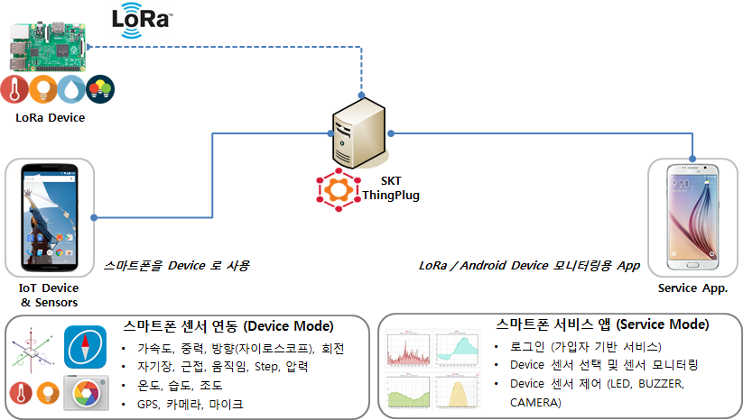

Sensor 목록
---
1. Battery : temperature(℃), charge level(％)
2. Temperature(℃)
3. Humidity(％)
4. Noise(㏈)
5. GPS : latitude(˚), longitude(˚), altitude(˚)
6. Air pressure(h㎩)
7. Brightness(㏓)
8. Proximity(㎝)
9. Accelerometer : X(㎨), Y(㎨), Z(㎨)
10. Orientation : azimuth(˚), pitch(˚), roll(˚)
11. Gravity : X(㎨), Y(㎨), Z(㎨)
12. Gyroscope : X(˚), Y(˚), Z(˚)
13. Magnetic field : X(µT), Y(µT), Z(µT)
14. Step detector(detection)
15. Step count(steps)

Actuator 목록
---
1. Buzzer : ringtone, notification, alarm
2. LED : off, red, green, blue, magenta, cyan, yellow, white
3. Camera : back, front

> 카메라로 촬영한 사진은 Google Drive API를 통해 주고받게 됩니다. Google Drive API 사용을 위해서는 **[링크](GoogleDrive.md)**의 과정을 진행하여야 합니다.

## Device Application
---
1. 동작 환경
	- Android OS 4.3(Jelly Bean, API Level 18) 이상
2. App. 권한 승인
	- Android OS 6.0(Marshmallow, API Level 23) 이상의 단말에서는 GPS 및 카메라 사용, Noise 센서 표시에 필요한 권한 허용 팝업이 표시됩니다. Android OS 6.0 미만의 단말에서는 App설치 시 권한을 확인하게 됩니다.
	 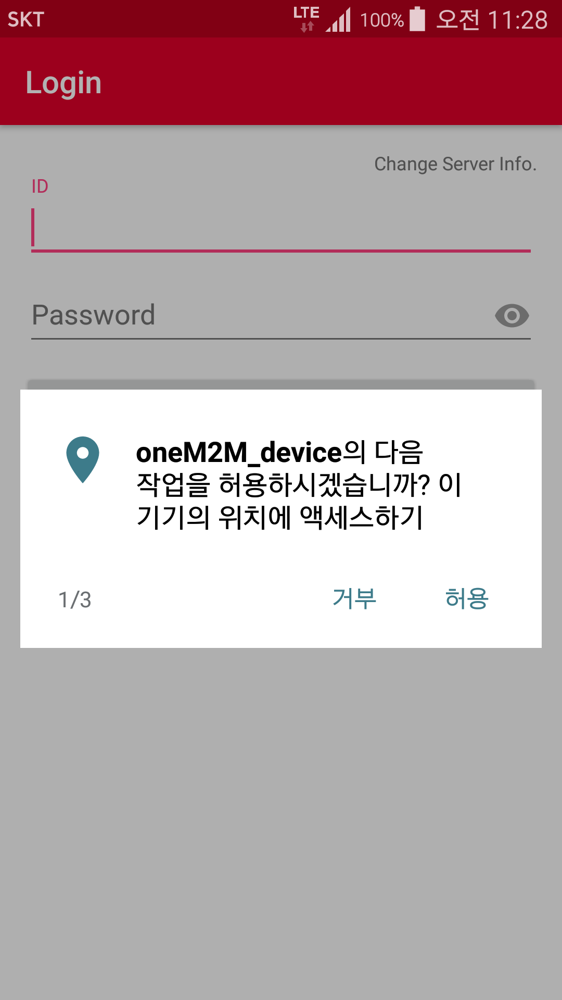 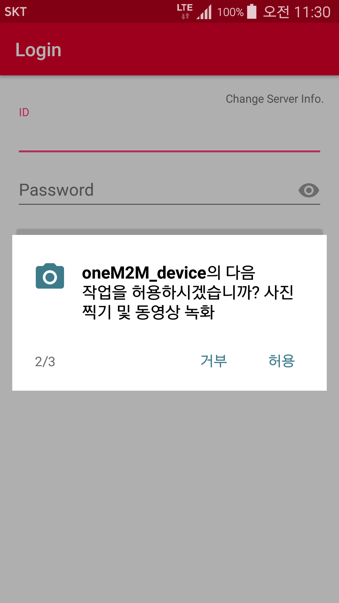 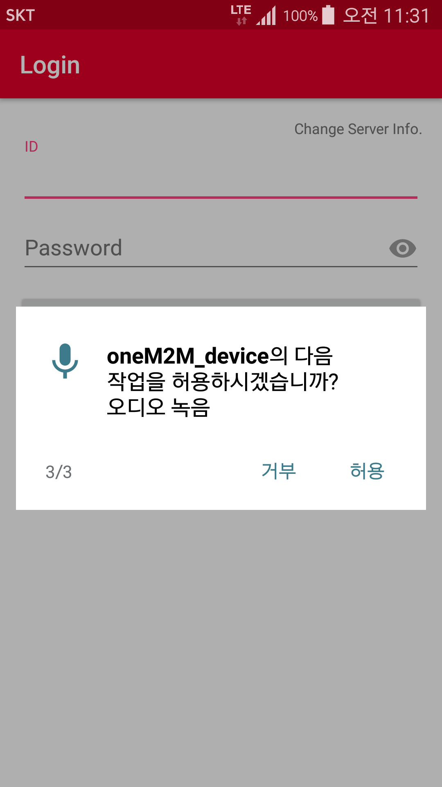
3. 로그인
	 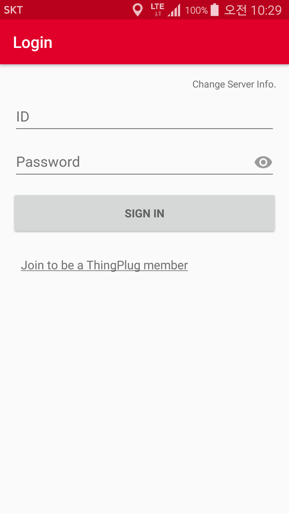
    - ThingPlug 포털 ID와 Password를 입력합니다. 한번 로그인하면 환경설정에서 로그아웃하기 전까지 정보가 유지됩니다. 
    - 아직 ThingPlug에 가입하지 않은 경우에는, 'Join to be a ThingPlug member'를 선택하여 ThingPlug 포털에서 신규회원가입을 진행하시기 바랍니다.
    - ThingPlug 서버주소 및 접속환경이 변경된 경우에는 `Change Server Info.`를 선택하여 설정값 변경이 가능합니다.
	- __서버 환경 설정__(Change Server Info.)
		 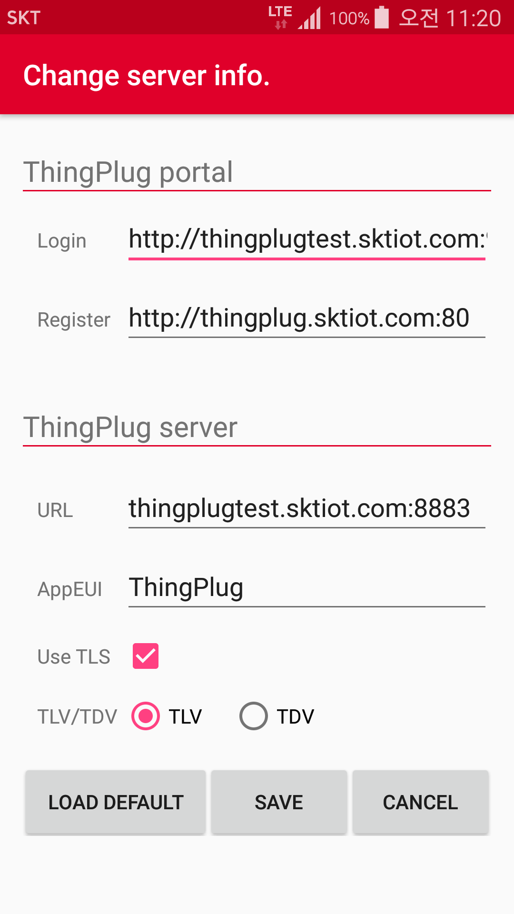
    	- ThingPlug 포털 정보
    		- Login : 로그인 API URL
    		- Register : 디바이스 등록 API URL
    	- ThingPlug server 정보
    		- URL : ThingPlug server URL
    		- AppEUI : CSE 생성 접두어
    		- Use TLS : TLS 사용 여부
    		- TLV/TDV : 센서 데이터 포맷
    	- LOAD DEFAULT : 기본 설정값 불러오기
4. 약관 동의
	 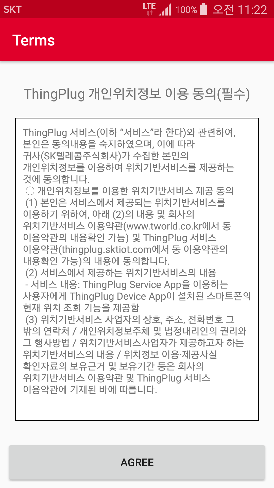
	- AGREE를 선택할 경우, 위치정보 사용동의를 통해 해당 단말의 위치정보를 ThingPlug에 전송하게 됩니다.
5. Google account 선택
	 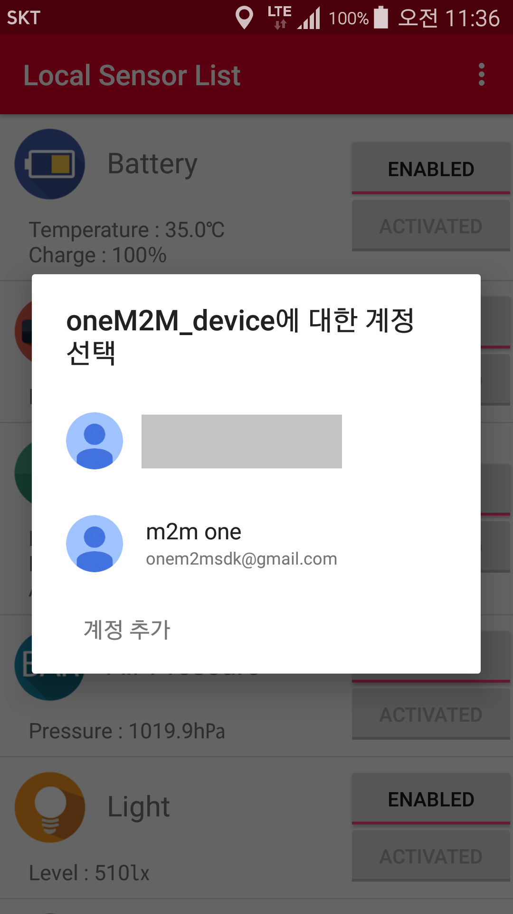
    - Camera 촬영 이미지를 업로드할 Google account를 선택합니다. Service App과 동일한 account를 사용해야 합니다.
    - Camera 촬영 기능을 사용하지 않을 경우는 Back키를 눌러 이 단계를 건너뛰면 됩니다.
6. 로컬 센서 목록
	 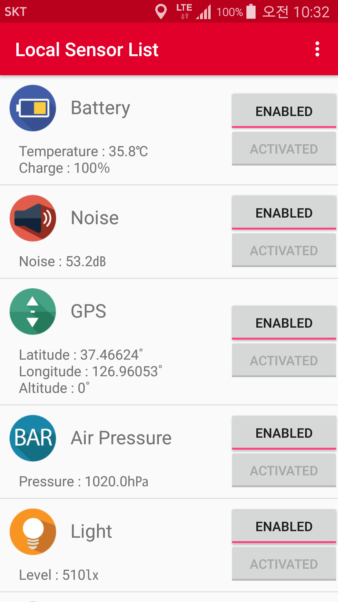
	- 해당 단말에서 지원하는 센서 목록이 표시됩니다.
	- 센서 켜기(ENABLED)/끄기(DISABLED) 기능 : ThingPlug로 전송할 센서 정보를 선택할 수 있습니다. Device App에서 특정 센서를 끄면 Service App에서 원격으로 해당 센서의 활성화 및 비활성화 제어가 불가능하게 됩니다.
	- 센서 활성화(ACTIVATED)/비활성화(DEACTIVATED) 상태 표시 : Service App을 통해 원격에서 ThingPlug로 전송할 센서 정보를 선택할 수 있습니다. 원격에서 제어중인 특정 센서의 활성화 여부를 확인할 수 있습니다.
	- 특정 센서 선택 시 해당 센서의 상세 화면으로 이동합니다.
7. 센서 상세 화면
	 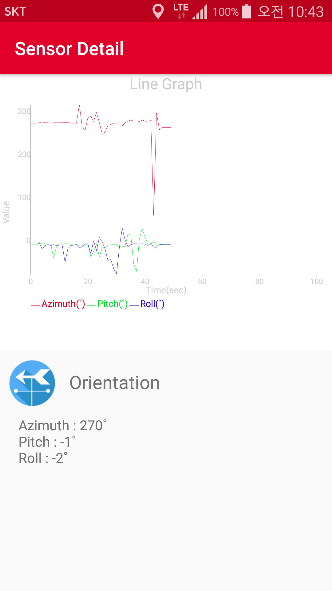
    - 센서 상태값을 그래프로 표시합니다. 센서값에 따라 세로축이 가변으로 변하도록 설정되어 있습니다.
8. 환경 설정
	 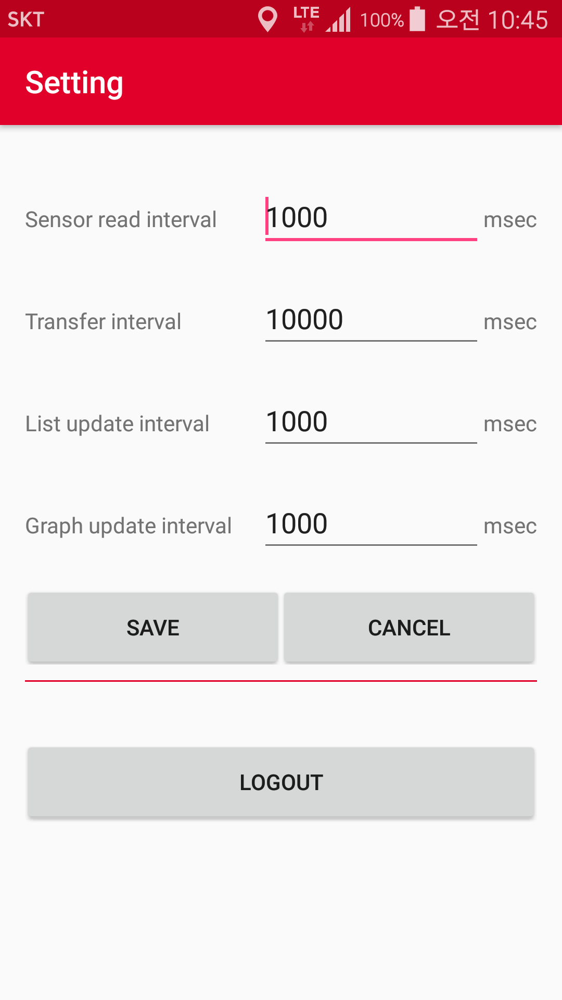
    - 센서 감지 간격(Sensor read interval, msec) : 센서에서 값을 읽어오는 간격
    - 센서 정보 전송 간격(Transfer interval, msec) : 센서 정보를 ThingPlug 서버로 전송하는 간격
    - 센서 목록 갱신 간격(List update interval) : 센서 목록 화면을 갱신하는 간격
    - 센서 상태 그래프 갱신 간격(Graph update interval) : 센서 상세 화면의 그래프를 갱신하는 간격
    - LOGOUT : ThingPlug 포털에서 로그아웃합니다. 단, 기기해지는 자동으로 되지 않으므로 ThingPlug 포털에서 수동으로 기기해지를 해주어야, 향후 해당 단말을 재등록할 수 있습니다.

## Service Application
---
1. 동작 환경
	- Android OS 4.3(Jelly Bean, API Level 18) 이상
2. 로그인
	 
    - ThingPlug 포털 ID와 Password를 입력합니다. 한번 로그인하면 환경설정에서 로그아웃하기 전까지 정보가 유지됩니다.
	- __서버 환경 설정__(Change Server Info.)
		 
    	- ThingPlug 포털 정보
    		- Login : 로그인 API URL
    		- Search : 디바이스 목록 조회 API URL
    	- ThingPlug server 정보
    		- URL : ThingPlug server URL
    		- AppEUI : CSE 생성 접두어
    		- Use TLS : TLS 사용 여부
    		- TLV/TDV : 센서 데이터 포맷
    	- LOAD DEFAULT : 기본 설정값 불러오기
3. 디바이스 선택
	 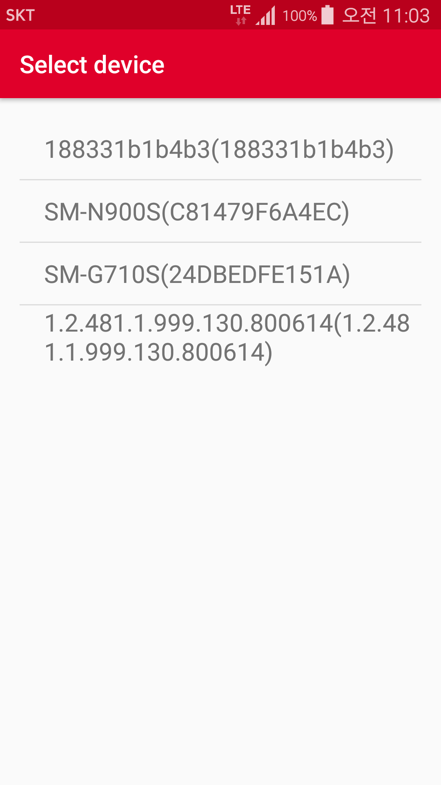
	- ThingPlug 포털에 등록된 디바이스 목록을 표시합니다. 한번에 한개의 디바이스를 모니터링 할 수 있으므로 모니터링하고자 하는 디바이스를 선택합니다.
4. Google account 선택
	 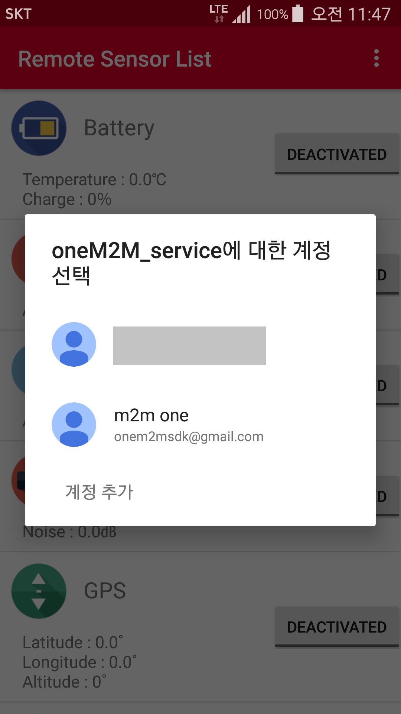
    - Device App에서 선택한 Google account와 동일한 account를 선택합니다.
5. 원격 센서 목록
	 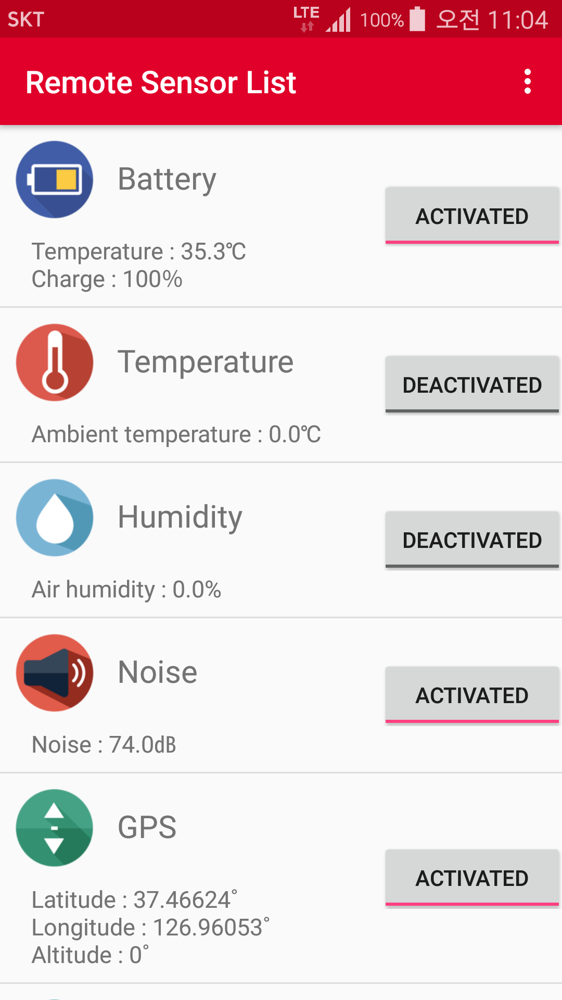
	- 전체 센서 목록이 나열되며, Device App에서 미지원하거나 꺼진(DISABLED) 센서의 경우 비활성화된 상태로 표시됩니다.
	- 센서 활성화(ACTIVATED)/비활성화(DEACTIVATED) 기능 : Device App의 센서 활성화 상태를 원격에서 변경합니다.
	- 특정 센서 선택 시 해당 센서 상세 화면으로 이동합니다.
6. 센서 상세 화면
	 
    - 센서 상태값을 그래프로 표시합니다. 센서값에 따라 세로축이 가변으로 변하도록 설정되어 있습니다.
7. 환경 설정
	 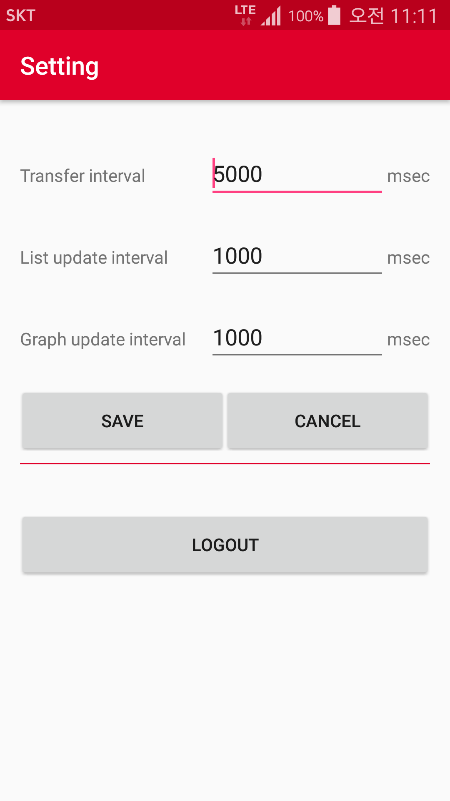
    - 센서 정보 조회 간격(Transfer interval, msec) : 센서 정보를 ThingPlug 서버로부터 조회하는 간격
    - 센서 목록 갱신 간격(List update interval) : 센서 목록 화면을 갱신하는 간격
    - 센서 상태 그래프 갱신 간격(Graph update interval) : 센서 상세 화면의 그래프를 갱신하는 간격
    - LOGOUT : ThingPlug 포털에서 로그아웃합니다. 서버환경설정 변경이 필요할 경우, 로그아웃해야 합니다.
